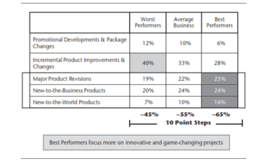
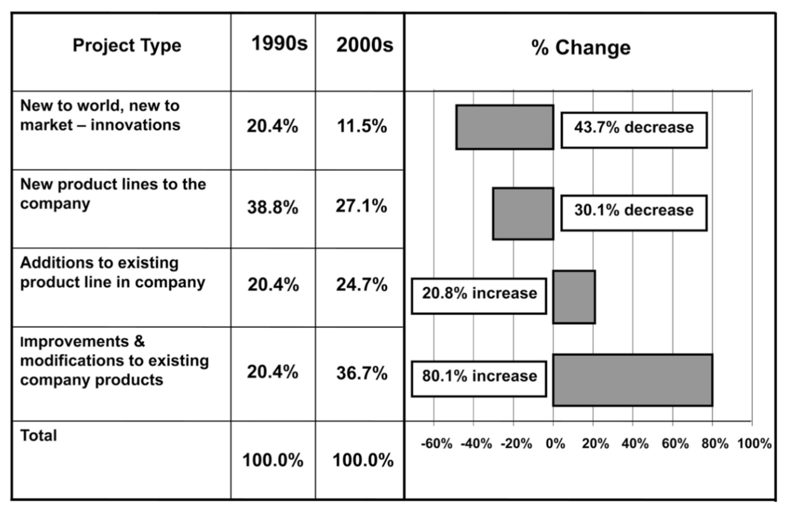

Added value in any business, measured in financial terms, can only be achieved in two ways, increased revenue or decreased cost.  Increased revenue must be profitable and decreased cost must not decrease profitable revenue by more than the cost benefit for them to add value.  

Statistical methods and predictive analytics have been applied to cost reduction in manufacturing over the last 50 years delivering significant added value to manufacturing businesses.  Extending these results via the more advanced capability of data science is a natural progression and is delivering further cost reduction.

Statistical methods and predictive analytics have also been successfully applied to increasing revenue via improved results of marketing programs and reduced cost of incremental new product development. Data science is extending the value added from these activities as well.

Capgemini reported in 2012 that companies have seen a 26% average performance improvement over the past three years and they expect it will improve 41% over the the next three for processes where analytics has been applied 1

However, more frequent market success of major new product development projects via application of statistical methods and predictive analytics has been elusive.   This has primarily been due to management decisions to force short term, risk averse decision making processes and metrics onto the selection and management of development projects 1.  Studies show that companies that take more risk in selecting projects for their product development projects get better results 1 (see Table 1 below).

Despite this knowledge, in recent years, companies are choosing to do this less often 2(see Table 2 below).

Cost reduction and incremental product development generally deliver diminishing returns in the absence of significant innovation to bring new products, markets, technologies and business models into practice.  For companies to continue to realize significant value added from data science, they will need to embrace the application of data science to innovation to deliver successful major product development projects.  Its application to major product development projects must be done differently than for cost reduction and incremental product development to be successful.  There has been significant academic activity on this subject in recent years but, so far, little application of what has been learned by manufacturing companies.  I will focus on this knowledge, and potential for exploiting it, in future blog posts.

**References:**
1. Cooper, R.G. (2013a), "Where Are All the Breakthrough New Products?", *Research-Technology Management*, Vol. 56, Issue 5, pp, 25-33.
2. Cooper, R.G. (2013b), "New Products - What Separates the Winners From the Losers and What Drives Success?", *The PDMA Handbook of New Product Development*, John Wiley & Sons, Hoboken, NJ.
